# CS 184: Computer Graphics and Imaging, Spring 2023

## Project 3-2: Pathtracer
## Michael Lin, Rachel Lee
 *** 
### Overview
In this project, we implemented mirror material in Part 1 for the surfaces of the object in the image by calculating the reflection and refractions. We also implemented different focus lenses for the camera in Part 4 to help simulate different focus points in an image through the camera lens.
### Part 1  
- **Show a sequence of six images of scene CBspheres.dae rendered with max_ray_depth set to 0, 1, 2, 3, 4, 5, and 100. The other settings should be at least 64 samples per pixel and 4 samples per light. Make sure to include all screenshots.
Point out the new multibounce effects that appear in each image.**
 - ```m=0:```
 - 
 - ```m=1:```
 - 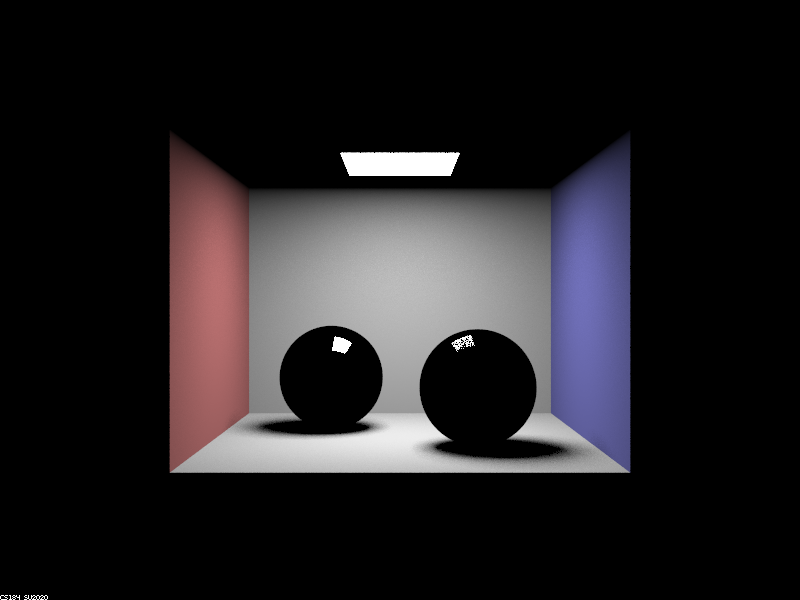
 - ```m=2:```
 - 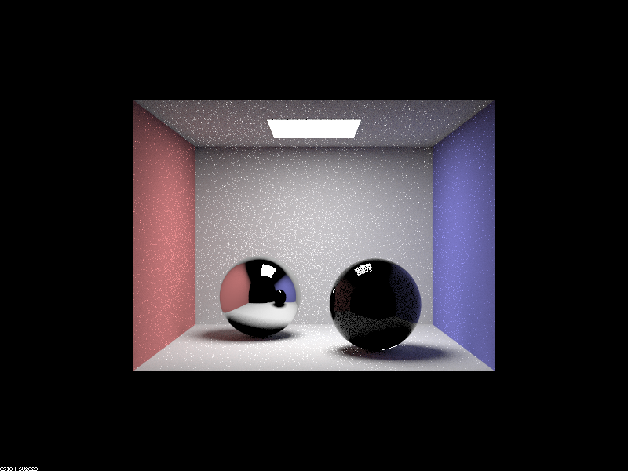
 - ```m=3:```
 - 
 - ```m=4:```
 - 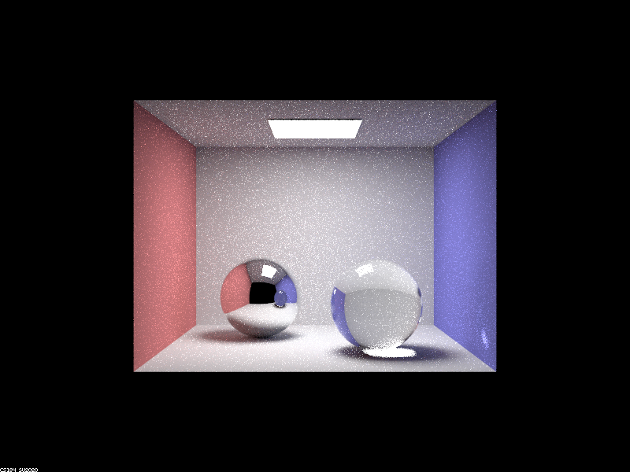
 - ```m=5:```
 - 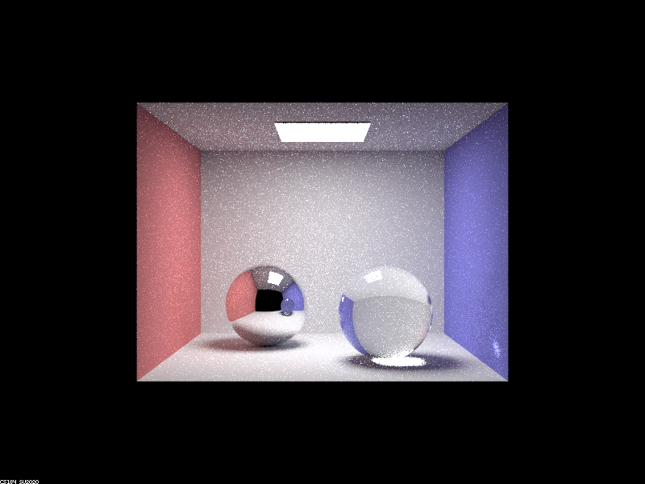
 - ```m=100:```
 - 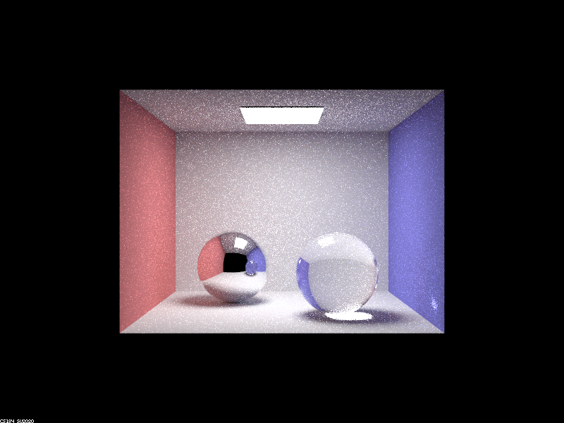
- **Explain how these bounce numbers relate to the particular effects that appear. Make sure to include all screenshots.**
When ```m=0```, we see that the light does not reflect off any surface so the image is almost completely dark except for the light at the top. However, as we increase the ```m``` value, we see that the light begins to bounce off the surface multiple times to create a more illuminated environment and brighter surfaces.

### Part 4 

- **In a few sentences, explain the differences between a pinhole camera model and a thin-lens camera model.**
    - In the pinhole camera model, light is passed through a "pinhole" to form an inverted image where everything is assumed to be in focus. In the thin-lens camera model the objects are only in focus when they're within a plane that is at ```focalDistance``` from the lens.
- **Show a "focus stack" where you focus at 4 visibly different depths through a scene. Make sure to include all screenshots.**
 - ```d=1:```
 - 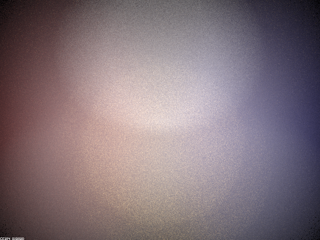
 - ```d=4.5:```
 - 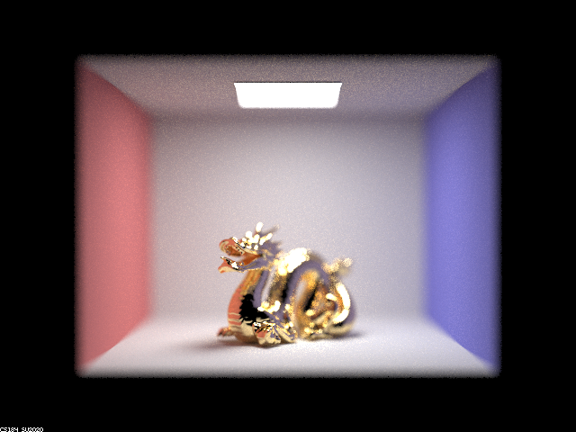
 - ```d=5:```
 - 
 - ```d=9:```
 - 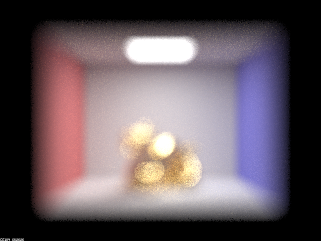
 

- **Show a sequence of 4 pictures with visibly different aperture sizes, all focused at the same point in a scene. Make sure to include all screenshots.**
- ```b=0.1:```
- 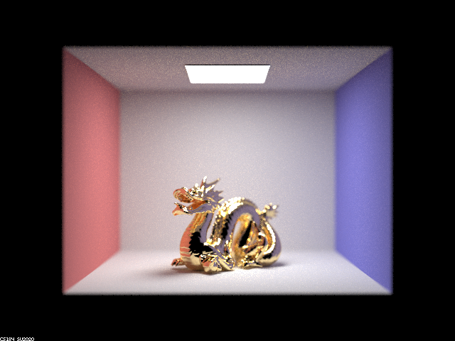
- ```b=0.2:```
- 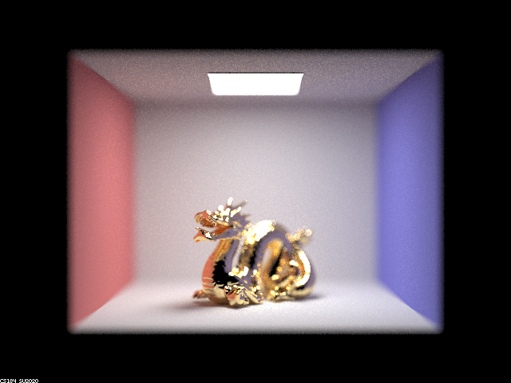
- ```b=0.3:```
- 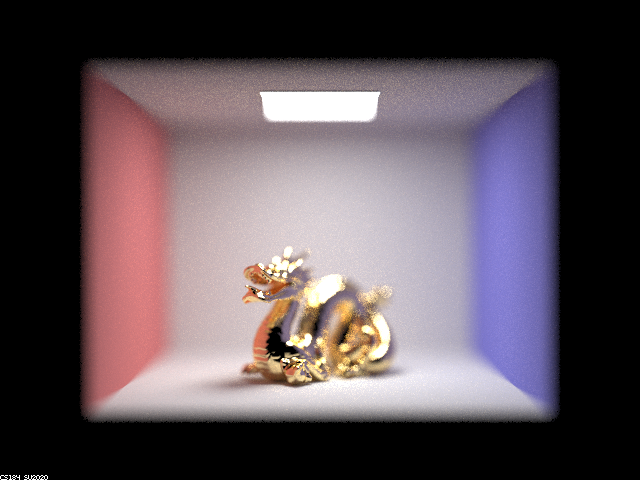
- ```b=0.4:```
- 